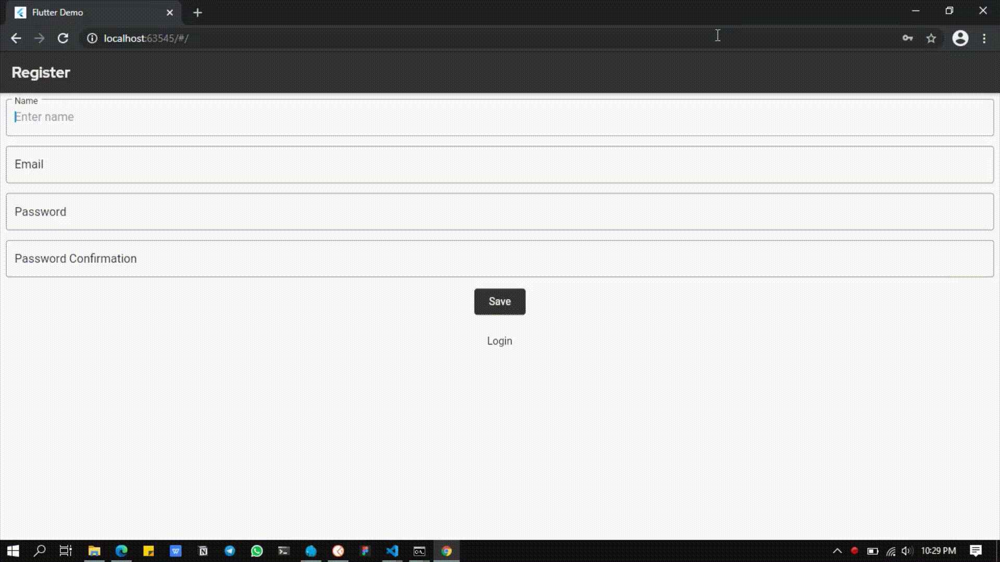

<h1 align="center">Welcome to FlutBlog!👋 </h1>
    

Simple blog applications like authenticate, create, read, update, delete. Create with Flutter for Frontend and Laravel for Backend with RESTful API, connect to database, routing and others.

### 📝 Licence

- Copyright © 2021 Hafid Ardiansyah.
- **Flutblog MIT License.**

---

- **Made with ❤️ by Hafid Ardiansyah**
